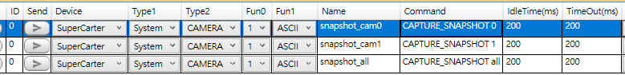

# SuperEagleEye (SEE_1.0) 使用者指南

*AMSC_MGMDA0 · DQA*

*SEE 軟體版本：至少 1.2.0*
*文件版本：0.2*

這份文件說明目前 `SEE_1.0` 的實際操作方式。

## 目前操作模型

- 目前請把：
    - `cam0`
    - `cam1`
    - `cam2`

視為固定的「邏輯相機槽位」。

- 目前行為：
    - `SEE_1.0` 啟動後，會自動把偵測到的相機分配給 `cam0`、`cam1`、`cam2`，並嘗試自動開啟
    - 平常操作請直接使用 `cam0`、`cam1`，不要再把它們當成 Windows `device_index`
    - 如果要交換兩個槽位背後的硬體，請用 `swap cam0 cam1`
    - `change cam0 cam1` 也可以用，功能與 `swap` 相同

## 常用小黑窗指令

### 查狀態

```text
status
list
list_devices
```

- `status`：查看 runtime 狀態
- `list`：查看目前已開啟的邏輯相機
- `list_devices`：查看目前偵測到的硬體、裝置資訊，以及每顆硬體對應到哪個邏輯槽位

### 開關相機

```text
open cam1
close cam1
swap cam0 cam1
change cam0 cam1
```

- `open cam1`：重新打開 `cam1` 這個邏輯槽位
- `close cam1`：關閉 `cam1`
- `swap cam0 cam1`：交換 `cam0` 和 `cam1` 背後的硬體
- `change cam0 cam1`：`swap` 的別名

### 拍照與錄影

```text
snapshot cam0
record_start cam0 60
record_stop cam0
open_output_folder
```

- `snapshot cam0`：讓 `cam0` 拍一張照
- `record_start cam0 60`：讓 `cam0` 開始錄影 60 秒分段
- `record_stop cam0`：停止 `cam0` 錄影
- `open_output_folder`：直接打開目前的輸出資料夾

## 在 SuperCarter 中的觀念

- 目前建議：
    - 使用 `cam0` / `cam1` 當作固定邏輯相機
    - 不要再依賴手動輸入 `device_index`
    - 若兩台相機對應反了，直接用 `swap cam0 cam1` **(請於運行前在小黑窗調適)**

## SuperCarter 下達給 SEE_1.0 的指令大全

- 這一節描述的是：
    - 不是小黑窗手動輸入的指令
    - 而是 `SuperCarter` 透過**指令**傳給 `SEE_1.0` 的正式控制指令

- 目前 `SuperCarter` 會使用兩種指令形式：
    - `ExecuteCameraCommand`
    - `QueryCameraState`

### SuperCarter 腳本編輯

- 請根據以下範例圖示選擇腳本內參數的設置：
    - `Device` 請選擇 `SuperCarter`
    - `Type1` 請選擇 `System`
    - `Type2` 請選擇 `CAMERA`
    - `Fun0` 請選擇 `1`
    - `Fun1` 請選擇 `ASCII`
    - `Name` 填寫該指令的名稱，所填寫的內容將變成圖片檔案的命名內容之一
    - `Command` 請參考以下關於 **`SEE1.0`** 指令的撰寫方式進行填寫

{ width="900" }

> SuperCarter 腳本編輯器中關於 **SEE1.0** 相關指令參數的選擇範例

### 一般欄位概念

- 每次由 `SuperCarter` 呼叫時，通常會帶這些欄位：
    - `command` 或 `query`：真正的指令名稱
    - `camera_id`：要操作的邏輯相機，例如 `cam0`、`cam1`、`cam2`；凡是針對相機的指令，這個欄位都要明確填寫
    - `args_json`：補充參數，格式是 JSON 字串
    - `auth_token`：驗證用的共享金鑰

- 如果只是看操作觀念，你可以先記住：
    - 有動作的指令，用 `ExecuteCameraCommand`
    - 只是查狀態的指令，用 `QueryCameraState`

- 相機指定規則：
    - 指令名稱本身通常不會直接寫出 `cam0` 或 `cam1`
    - 真正指定哪一顆邏輯相機，是靠 `camera_id` 欄位
    - 例如要讓 `cam0` 截圖，應該送：
        - `command = "CAPTURE_SNAPSHOT"`
        - `camera_id = "cam0"`
        - 例如要讓 `cam1` 開始錄影，應該送：
        - `command = "START_RECORD"`
        - `camera_id = "cam1"`

### ExecuteCameraCommand 指令

#### `PING`

- 用途：
    - 確認 `SEE_1.0` 還活著
    - 檢查目前 runtime 看到的連線狀態

- 通常參數：
    - `camera_id` 可空

- 成功時會回：
    - `ack_hex`
    - `connection_state`

- 範例：`PING`

#### `OPEN_CAMERA`

- 用途：
    - 打開指定的邏輯相機槽位

- 常見用法：
    - `camera_id = "cam0"`；這個欄位就是實際要開啟的相機

- 成功時會回：
    - 這顆邏輯相機目前的完整狀態
    - 例如 `opened`、`recording`、`width`、`height`、`fps`

- 適合什麼時候用：
    - 預覽視窗被關掉後想重新打開
    - 某個槽位被關掉後重新開啟

- 範例：`OPEN_CAMERA cam0`

#### `CLOSE_CAMERA`

- 用途：
    - 關閉一個邏輯相機槽位

- 常見用法：
    - `camera_id = "cam1"`；這個欄位就是實際要關閉的相機

- 成功時會回：
    - `camera_id`
    - `closed = true`

- 範例：`CLOSE_CAMERA cam1`

#### `SWAP_CAMERAS`

- 用途：
    - 交換兩個邏輯槽位背後實際綁定的硬體

- 這個指令很適合：
    - `cam0` 跟 `cam1` 對應反了
    - 兩顆相機畫面左右或上下顛倒分配

- 字串指令格式：


```text
SWAP_CAMERAS [source_camera_id] [target_camera_id]
```

- 範例：`SWAP_CAMERAS cam0 cam6`

- 說明：
    - `source_camera_id`：要交換出去的邏輯槽位
    - `target_camera_id`：要交換進來的邏輯槽位
    - 執行後，這兩個邏輯槽位背後綁定的硬體會互換

- 補充：
    - 目前底層 RPC 仍然會把這兩個值放在 `args_json`
    - 但文件主體請把它理解成兩個明確的位置參數即可

- 範例：`SWAP_CAMERAS cam0 cam6`

#### `START_RECORD`

- 用途：
    - 讓指定邏輯相機開始錄影

- 常見參數：
    - `camera_id = "cam0"` 或其他目標槽位

常見參數：

```json
{
  "duration_sec": 60,
  "file_prefix": "cam0"
}
```

- 可選欄位：
    - `duration_sec`
    - `output_dir`
    - `file_prefix`

- 成功時會回：
    - `camera_id`
    - `recording = true`
    - `duration_sec`

- 前提：
    - 該相機必須已經有畫面

- 範例：`START_RECORD cam0 {"duration_sec":60}`

#### `STOP_RECORD`

- 用途：
    - 停止指定邏輯相機的錄影

- 常見用法：
    - `camera_id = "cam0"`；這個欄位就是實際要停止錄影的相機

- 成功時會回：
    - `camera_id`
    - `recording = false`

- 範例：`STOP_RECORD cam0`

#### `CAPTURE_SNAPSHOT`

- 用途：
    - 讓指定邏輯相機拍一張照

- 補充說明：
    - 這就是 `SuperCarter` 要求 `SEE_1.0` 截圖時應該送的正式指令。

- 字串指令格式：


```text
CAPTURE_SNAPSHOT [cam0|cam1|cam2|all]
```

- 目標定義：
    - `cam0|cam1|cam2`：指定其中一個邏輯相機拍照
    - `all`：目前所有已開啟的邏輯相機都各拍一張

- 可接受的 target 寫法：
    - `cam0|cam1|cam2|all`
    - `0|1|2`

- 結構化公式：


```json
{
  "command": "CAPTURE_SNAPSHOT",
  "camera_id": "<cam0|cam1|cam2|all>",
  "args_json": "{} | {\"output_path\":\"D:\\\\temp\\\\cam0.jpg\"}"
}
```

- 也可以指定輸出檔案：


```json
{
  "output_path": "D:\temp\cam0.jpg"
}
```

- 成功時會回：
    - `camera_id`
    - `snapshot_path`

- 如果使用 `camera_id = "all"`：
    - 會一次對所有已開啟的相機各拍一張
    - 回傳內容會改成：
        - `camera_id = "all"`
        - `snapshots`：每顆相機對應的 `snapshot_path`
        - `count`：實際完成的截圖數量

- 注意：
    - `all` 模式建議不要搭配單一 `output_path`
    - 讓 runtime 自動產生每顆相機各自的檔名會比較安全

- 補充規則：
    - `all` 目前只適用於 `CAPTURE_SNAPSHOT`
    - `OPEN_CAMERA`、`CLOSE_CAMERA`、`SET_CAMERA_CONFIG` 這類單機性質指令，仍必須指定單一 `camera_id`

- 範例：`CAPTURE_SNAPSHOT cam0`, `CAPTURE_SNAPSHOT all`

#### `SET_CAMERA_CONFIG`

- 用途：
    - 更新某個邏輯相機的拍攝設定

- 相機指定：
    - `camera_id = "cam0"` 或其他目標槽位

- 可設定欄位：
    - `width`
    - `height`
    - `fps`
    - `recording_duration`
    - `max_folder_size_gb`

- 範例：`SET_CAMERA_CONFIG cam0 {"width":1280,"height":720,"fps":20}`


#### `SET_OUTPUT_ROOT`

- 用途：
    - 更新目前快照與錄影的預設儲存資料夾

- 補充說明：
    - `SuperCarter` 平常就是靠這個指令，把目前選到的輸出路徑推給 `SEE_1.0`。

- 範例：`SET_OUTPUT_ROOT {"output_dir":"D:\capture_output"}`

- 也可以用：


```json
{
  "save_path": "D:\capture_output"
}
```

- 成功時會回：
    - 目前生效的 `output_dir`

#### `OPEN_OUTPUT_FOLDER`

- 用途：
    - 取得目前輸出資料夾的位置

- 目前實作會回：
    - `output_dir`

- 補充說明：
    - 通常是 `SuperCarter` 拿到這個路徑後，再決定是否幫你打開資料夾。

- 範例：`OPEN_OUTPUT_FOLDER`

#### `SHUTDOWN`

- 用途：
    - 要求整個 `SEE_1.0` runtime 結束

- 這通常對應：
    - `Stop SEE_1.0`
    - 或某些完整停止流程

- 成功時會回：
    - `shutdown = true`

- 範例：`SHUTDOWN`

### QueryCameraState 查詢指令

#### `GET_STATUS`

- 用途：
    - 查整個 runtime 的整體狀態

- 會回：
    - `connection_state`
    - `uptime_sec`
    - `camera_count`
    - `default_camera_id`
    - `recording_cameras`

- 範例：`GET_STATUS`

#### `LIST_CAMERAS`

- 用途：
    - 查目前所有已開啟的邏輯相機

- 每個項目通常包含：
    - `camera_id`
    - `device_index`
    - `friendly_name`
    - `opened`
    - `recording`
    - `width`
    - `height`
    - `fps`

- 範例：`LIST_CAMERAS`

#### `LIST_DEVICES`

- 用途：
    - 查目前 Windows 偵測到的硬體相機與對應槽位

- 每個項目可能包含：
    - `camera_index`
    - `device_index`
    - `friendly_name`
    - `device_id`
    - `pnp_device_id`
    - `location_information`
    - `manufacturer`
    - `is_external`
    - `assigned_camera_id`
    - `opened_camera_id`

- 這個查詢很重要，因為：
    - 當兩顆相機同型號時，光看 `friendly_name` 常常不夠
    - 這時可以搭配 `device_id` / `pnp_device_id` 來辨識

- 範例：`LIST_DEVICES`

#### `GET_CAMERA_CONFIG`

- 用途：
    - 查某個邏輯相機目前的設定

- 相機指定：
    - `camera_id = "cam0"` 或其他目標槽位

- 通常會回：
    - `width`
    - `height`
    - `fps`
    - `recording_duration`
    - `max_folder_size_gb`

- 範例：`GET_CAMERA_CONFIG cam0`

#### `GET_RECORD_STATE`

- 用途：
    - 查某個邏輯相機目前是否正在錄影

- 相機指定：
    - `camera_id = "cam0"` 或其他目標槽位

- 通常會回：
    - `camera_id`
    - `recording`

- 範例：`GET_RECORD_STATE cam0`

## SuperCarter 最常用的幾個指令

- 如果只看最常用的操作，通常是這幾個：
    - `SET_OUTPUT_ROOT`
    - `CAPTURE_SNAPSHOT`
    - `START_RECORD`
    - `STOP_RECORD`
    - `GET_STATUS`
    - `LIST_DEVICES`

## 輸出路徑

- 目前輸出資料夾行為：
    - `SuperCarter` 會透過 `SET_OUTPUT_ROOT` 把目前儲存位置推給 `SEE_1.0`
    - 拍照與錄影都會寫到這個資料夾
    - 在小黑窗可直接用 `open_output_folder` 打開

## 已知注意事項

- 目前已知狀況：
    - 兩台同型號相機可能會因 Windows 或 OpenCV backend 導致畫面異常
    - `cam1` 在 `CAP_MSMF` 下可能失敗，runtime 會在讀流失敗後切換 backend 重試
    - 如果兩台相機共用同一個 USB hub，穩定性可能更差
    - 若畫面對應錯誤，請先用 `list_devices` 檢查，再用 `swap cam0 cam1`
    - 若 `close cam1` 過去曾造成異常，現在已加強關閉流程，但仍建議優先用最新打包版本驗證

## 建議排查順序

1. 啟動 `SEE_1.0`
2. 打 `list_devices`
3. 確認每顆硬體的 `assigned_camera_id` / `opened_camera_id`
4. 如果相機對應反了，打 `swap cam0 cam1`

## 重要提醒

> 如果畫面仍不穩，請把兩顆相機分開插到不同 USB port，不要共用同一個 hub。
> 兩顆同型號相機共用同一個 hub 時，容易出現黑畫面、卡頓、掉幀或取流異常。


